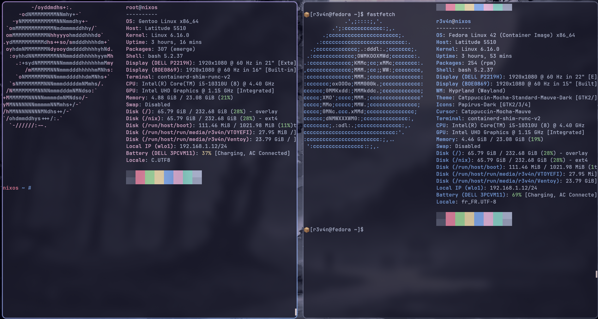

<div align="center">
  
  
  
  # Agentic NixOS

  **A secure, AI-enhanced DevOps workstation built on NixOS + Hyprland**

  [](https://nixos.org)
  [](https://hyprland.org)
  [](/)
  [](/)

</div>

---

## 📸 Screenshots & Demo

<div align="center">

### 🎥 Live Demo

https://github.com/Erwan923/Agentic_NixOS/assets/Présentation.mov

</div>

---

## 🚀 What Makes This Special?

This configuration transforms NixOS into a **professional DevOps workstation** that prioritizes both security and productivity. Based on [**Sly-Harvey/NixOS**](https://github.com/Sly-Harvey/NixOS), it adds enterprise-grade security and AI-powered workflows.

**🔒 Security First**: Multiple protection layers (AppArmor + Firewall + Network hardening)  
**🤖 AI Integration**: Natural language commands with kubectl-ai, gemini-cli, and codex  
**📦 Secure Containers**: Rootless Podman + Distrobox for safe isolated development  
**🎨 Beautiful Desktop**: Catppuccin Macchiato theme with Lavender accents and Colloid icons  
**⚡ DevOps Ready**: Complete Kubernetes + Docker + Infrastructure-as-Code toolkit  

---

## 🛠️ Development Stack

| Category | Tools | What They Do |
|----------|-------|--------------|
| **🤖 AI Agents** | kubectl-ai, gemini-cli, codex | Natural language → commands |
| **☸️ Kubernetes** | k3d, kubectl, helm, k9s | Local clusters + management |
| **🐳 Containers** | Docker, Podman (rootless), Distrobox | Secure isolated environments |
| **🔧 Infrastructure** | Terraform, Ansible, Jenkins | Infrastructure as Code |
| **💻 Development** | VSCode, Nixvim, 30+ dev-shells | Modern editing + language support |
| **🎨 Desktop** | Hyprland, Catppuccin, Waybar | Beautiful Wayland environment |

---

## 🔒 Security Features

### Built-in Protection
- **🛡️ Firewall**: Strict rules, only essential ports open
- **🔐 AppArmor**: Mandatory Access Control for process isolation
- **🚫 Network Hardening**: Anti-scan, SYN flood protection
- **👤 Rootless Containers**: No privileged processes
- **🔑 Sudo Protection**: Password required for admin actions

### What This Means for You
```bash
# Your containers run without root privileges
distrobox create fedora  # No sudo needed, fully isolated

# Firewall blocks unwanted connections automatically
# Only media server (DLNA) ports are open

# AI tools work safely in isolated environments
kubectl ai "create nginx deployment"  # Secure by design
```

---

## 📦 Container Architecture

<div align="center">

</div>

**Why containers matter**: Traditional package managers can break NixOS. Our solution? Secure, persistent container environments.

### How It Works
```
You type: distrobox create ubuntu
    ↓
Podman creates rootless container
    ↓
Stored in ~/.local/share/containers/
    ↓
Install anything: apt, npm, pip, go get
    ↓
Survives NixOS rebuilds!
```

### Benefits
- **🔒 Secure**: No root access, user-isolated
- **📁 Persistent**: Containers survive reboots and system updates
- **🏠 Integrated**: Access your home directory naturally
- **🚀 Fast**: No sudo overhead

---

## 🤖 AI-Powered Workflow

Transform complex commands into natural language:

```bash
# Kubernetes made simple
kubectl ai "create a nginx deployment with 3 replicas"
kubectl ai "show me all failing pods"

# Google AI assistant
gemini-cli "explain kubernetes networking"
gemini-cli "write terraform for AWS EC2"

# Code generation
codex "create a python web scraper"
codex "write golang REST API"
```

**Setup**: Export `OPENAI_API_KEY` and `GEMINI_API_KEY` in your shell.

---

## 🎨 Visual Design

### Theme Details
- **Color Palette**: Catppuccin Macchiato (dark, warm theme)
- **Accent Color**: Lavender (#b4befe) for highlights and active elements
- **Icons**: Colloid-teal-dark for modern, consistent iconography
- **Font**: JetBrains Mono Nerd Font for terminal and UI
- **Wallpaper**: Cyberpunk cityscape (easily customizable)

### Consistency Across the System
The Lavender accent color flows through every component:
- **Hyprland**: Window borders and focus indicators
- **Waybar**: Active workspace and status highlights  
- **GTK/Qt Apps**: Buttons, selections, and active states
- **Terminal**: Prompt colors and syntax highlighting

### Easy Customization
```bash
# Change theme (in flake.nix)
theme = "Dracula";          # Switch to Dracula theme

# Change wallpaper (in flake.nix)  
wallpaper = "moon";         # Options: cyberpunk, moon, dark-forest, etc.

# Rebuild to apply changes
sudo nixos-rebuild switch --flake .#Default
```

---

## 📁 Repository Structure

```
├── flake.nix                    # Main configuration (themes, user settings)
├── hosts/Default/configuration.nix  # System packages & security
├── modules/
│   ├── themes/Catppuccin/       # Theme configurations
│   ├── desktop/hyprland/        # Wayland compositor setup
│   ├── programs/                # Application configurations
│   └── hardware/                # Driver configurations
├── dev-shells/                  # 30+ development environments
└── assets/                      # Logo and wallpapers
```

---

## 🚀 Quick Start

### 1. Clone and Setup
```bash
# Clone the repository
git clone https://github.com/Erwan923/Agentic_NixOS.git
cd Agentic_NixOS

# Customize for your system
sed -i 's/username = "r3v4n"/username = "yourusername"/' flake.nix
```

### 2. Install and Build
```bash
# Build and apply configuration
sudo nixos-rebuild switch --flake .#Default

# Reboot to ensure everything loads properly
sudo reboot
```

### 3. Setup AI Tools (Optional)
```bash
# Create secure API key storage
mkdir -p ~/.secrets && chmod 700 ~/.secrets

# Add your API keys (get them from providers)
echo "your-openai-key" > ~/.secrets/openai-key
echo "your-gemini-key" > ~/.secrets/gemini-key
chmod 600 ~/.secrets/*

# Test AI integration
kubectl ai "create nginx deployment"
gemini-cli "explain kubernetes networking"
```

### 4. Development Environment
```bash
# Create isolated development container
distrobox create --image ubuntu:22.04 dev-env
distrobox enter dev-env

# Inside container: install anything without affecting host
apt update && apt install nodejs npm python3-pip
```

---

## 🌟 What's Included

### System Applications
- **Firefox** (hardened with Betterfox)
- **VSCode** (with extensions)
- **Obsidian** (note-taking)
- **Bitwarden** (password manager)
- **OBS Studio** (streaming)
- **GIMP & Inkscape** (graphics)

### Development Tools
- **Languages**: Node.js, Python, Go, Rust, Cargo
- **CLI Tools**: curl, jq, btop, nmap, tree, rsync
- **Git & GitHub**: Enhanced workflows
- **Media Server**: DLNA for streaming content

### Performance Optimizations
- **SSD-friendly**: Low swappiness (10%)
- **I/O optimized**: Tuned dirty ratios
- **Memory efficient**: Smart caching strategies

---

## 🔧 Customization

1. **Change user**: Edit `username` in `flake.nix`
2. **Switch editor**: Change `editor = "nixvim"` to `"vscode"`
3. **Pick terminal**: Set `terminal = "kitty"` or `"alacritty"`
4. **Graphics driver**: Adjust `videoDriver = "nvidia"` for your hardware

---

## 🛡️ Security Philosophy

**Defense in Depth**: Multiple security layers protect your work:
- Firewall blocks unauthorized access
- AppArmor isolates applications
- Rootless containers prevent privilege escalation
- Network hardening stops common attacks
- Password-protected admin access

**Zero Trust Containers**: Every development environment runs without privileges, ensuring that even compromised containers can't damage your system.

---

<div align="center">
  
  **📄 License**: [LICENSE](./LICENSE)  
  **🌟 Based on**: [Sly-Harvey/NixOS](https://github.com/Sly-Harvey/NixOS)  
  **🔒 Security**: Hardened for production use  
  **🤖 AI**: Enhanced with intelligent tools  
  
</div>